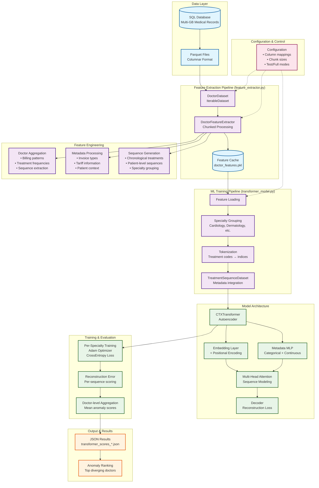

# Fraud Detection - Between Textbook and Reality

## Machine Learning Project Lifecycle

At university, you learn how a Big Data project should ideally run. You follow the machine learning lifecycle: start by defining the problem, process the data, build clean features, train models, and if all goes well, you end up with a functioning algorithm you can proudly solve your problem with.

Naturally, the spotlight is on modeling; after all, that’s what you’re studying Data Science for. Models are exciting, powerful, mathematically elegant.

That’s the theory.

In practice, things look very different. Especially when you’re not just doing a university project, but working with an industry partner and suddenly realize: the everyday reality of a machine learning project is 80% data chaos, hardware limits, shifting requirements, and constant adjustments. Welcome to the real world.

## What We (Can’t) Talk About

Ultimately, we’re not allowed to share all the details of our project due to privacy agreements; another real-life factor in applied data products. But here’s what we can say: we worked with millions of billing records and were tasked with uncovering suspicious patterns that show potential signs of fraudulent behavior among billers.

Our first idea was a classic clustering algorithm. The concept was simple and elegant: doctors with similar billing behavior would naturally group together, and anything that didn’t fit would stand out as an outlier.

But as we dug deeper into the research, we found a more exciting direction: **sequence models**, specifically **transformer architectures**, that could analyze billing histories as temporal sequences. We found that some people already tried this technique for different fraud detection systems, but it isn’t yet an over-explored approach. The more we read, the more it became clear: this is what we wanted to try. Not just because they seemed more promising, but also because it’s pretty exciting to build your own transformers.

So far, until the brainstorming phase, everything worked out well — but it was also where our nice, clean lifecycle dream came to a screeching halt.

## When Everything Keeps Changing

What we originally saw as fixed parameters — data structure, research question, project goals — turned out to be anything but stable. Our partner kept changing how we could access and what data we could access, which impacted how we could build our model.

Our well-planned machine learning lifecycle started to feel more like a machine learning **merry-go-round**: the data we had just spent days cleaning suddenly came in a different format; features we had carefully engineered no longer matched the revised objectives.

We planned in days for data preparation, but ended up needing weeks.

Looking back, we didn’t adapt the project to fit the lifecycle; **we adapted the lifecycle to fit the project.**

After several frustrating “back to square one” moments, we finally accessed and prepared our dataset. We built a data pipeline that sorted treatment histories per biller chronologically and encoded them as numerical sequences. Using these, we trained **transformer-based encoder-decoder** to detect common patterns — and flag anything significantly different with a high anomaly score.

This gave us a way to perform statistical analyses based on sequence-modeled data — helping to uncover suspicious billing behavior.

## The eventual pipeline

## Comparing to Real Life

Of course, we had to know: **does it work?** We compared our results with cases that had already been flagged manually or identified through business rules by our partner. As expected many of our anomalies matched existing suspicions. We also uncovered a few new candidates.

It became clear just how valuable regular exchange with the partner was. Only their internal knowledge like specific exceptions or business context allowed us to interpret our model results in a meaningful way.

## The Model Was Cool - but Only One Part of the Job

The Transformer model was definitely a highlight. It’s impressive how such models can detect patterns, especially in an area where natural language, numbers, and behavioral patterns are so widespread and intertwined.

But as exciting as modeling is - it only made up about **30%** of our project time. The rest? **Data wrangling. Troubleshooting. Restructuring.** And then some more data wrangling.

We were looking forward to building a model. What we got was a crash course in data engineering, project flexibility, and communication.

## What We Learned

Our most important take-aways are:

- **Flexibility beats planning.** No plan survives first contact with real data.  
- **Time estimates are just that - estimates.** Feature engineering always takes longer than you think.  
- **First ideas aren’t always the best.** We’re glad we moved past our initial clustering approach.  
- **Interpretation is hard** Data doesn’t lie - but it won’t tell the truth unless you ask the right questions.  

In the end, our project may not have been “textbook perfect.” But it was **real**. And that’s exactly what made it so valuable, especially to our industry partner.